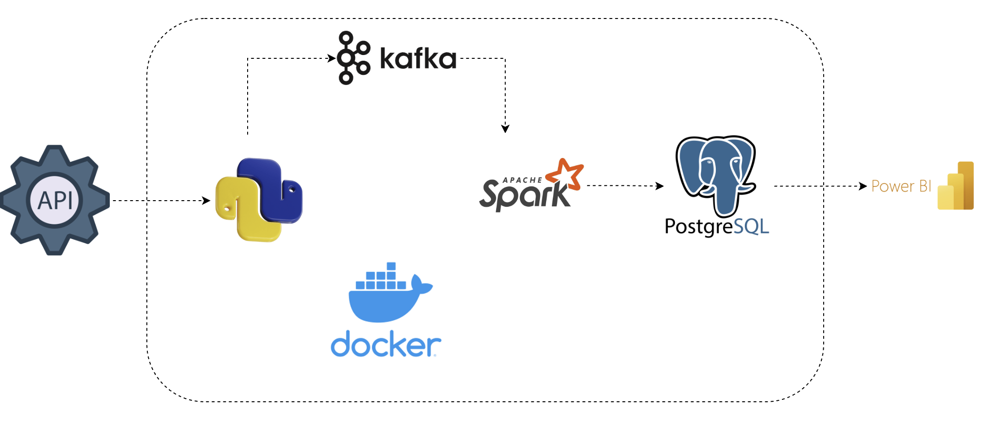

## Real Time Stock Market Analysis

### Background 
Financial data is only valuable when its timely. Traditional batch pipelines that process stock data hours after the fact are insufficient for analytics teams who need to track price movements, volumes spikes and market trends as they happen. This project builds a fully containerised, real-time data pipeline that ingests live stock market data from the Alpha Vantage API, streams it through Apache Kafka, processes it with PySpark Structured Streaming and persists it to a PostgreSQL database all visualised through Power BI dashboards.

### Overview
This project implements an end-to-end real-time data pipeline for stock market analysis. A Python producer continuously polls the Alpha Vantage API and publishes JSON events to a Kafka topic. A PySpark Structured Streaming consumer reads from that topic, applies transformations and writes the cleaned data to PostgreSQL. pgAdmin provides a visual interface for database management, Kafka UI allows inspection of topics and message flow, and Power BI connects directly to PostgreSQL for live dashboard reporting

Every component runs inside Docker containers, making the entire stack reproducible with a single docker compose up command. 

### Data Pipeline Architecture


### Project Setup Guide
This guide will walk you through setting up the project environment including repository setup.
#### Prerequisites
- Docker Desktop
- Python 3.10+ 
- Alpha Vantage API Key — free tier available at https://www.alphavantage.co
- Power BI Desktop (for dashboard access )


### Step 1: Clone the Repository

```bash
git clone https://github.com/fikeshi/Real-Time-Stock-Market-Analysis.git
cd Real-Time-Stock-Market-Analysis
```

### Step 2: Configure Environment Variables

Create a `.env` file in the root of the project directory:

```
ALPHA_VANTAGE_API_KEY=your_api_key_here
POSTGRES_USER=admin 
POSTGRES_PASSWORD=admin
POSTGRES_DB=stock_data
```
Note: The PostgreSQL credentials shown here are default values used for local development and are already defined in the project configuration


### Step 3: Start All Services

```bash
docker compose up -d
```
This will pull and start the following containers:
- `spark-master` — Spark master node
- `spark-worker` — Spark worker node (2 cores, 2GB memory)
- `consumer` — PySpark Structured Streaming job
- `kafka` — Confluent Kafka broker
- `kafka-ui` — Kafka UI dashboard
- `postgres` — PostgreSQL database
- `pgadmin` — pgAdmin for web UI


### Step 4: Start the Producer

The producer runs outside Docker and publishes stock data to Kafka.

```bash
pip install -r requirements.txt
cd producer
python producer.py
```
The producer will begin polling the Alpha Vantage API and publishing JSON messages to the `stock_analysis` Kafka topic.

### Step 5: Verify the Pipeline

Once all services are running, verify each layer:

| Service     | URL                        | Default Credentials         |
|-------------|----------------------------|-----------------------------|
| Kafka UI    | http://localhost:8085      | No login required           |
| Spark UI    | http://localhost:8081      | No login required           |
| pgAdmin     | http://localhost:5050      | admin@admin.com / admin     |
| PostgreSQL  | localhost:5434             | admin / admin               |

### Step 6: Connect Power BI

1. Open **Power BI Desktop**
2. Select **Get Data → PostgreSQL database**
3. Enter the following connection details:

```
Server:   localhost:5434
Database: stock_data
Username: admin
Password: admin
```

4. Select the relevant table and load the data

### Dashboard Preview


The dashboard provides the following views:
- **Average Close Price Movement Over Time** — line chart tracking TSLA, MSFT and GOOGL across 5-minute intervals
- **Average Close** — aggregated close price across all selected symbols
- **High of Day / Low of Day** — intraday price range summary cards
- **Raw Data Table** — granular view of all ingested records including open, high, low and close per interval

> The dashboard includes a slicer to filter by individual stock symbol (TSLA, MSFT, GOOGL).


## Docker Compose Common Commands

```bash
# Start all services in detached mode
docker compose up -d

# Stop all services
docker compose down

# Stop and remove volumes (full reset)
docker compose down -v

# View logs for all services
docker compose logs -f

# View logs for a specific service
docker compose logs -f kafka
docker compose logs -f consumer

# Restart a single service
docker compose restart consumer

# Check running containers
docker ps
```


## Architecture Overview
### Key Components

| Component     | Technology                    | Purpose                                        |
|---------------|-------------------------------|------------------------------------------------|
| Data Source   | Alpha Vantage REST API        | Real-time stock price and volume data          |
| Message Queue | Apache Kafka (KRaft)          | Durable, fault-tolerant event streaming        |
| Processing    | Apache Spark (PySpark)        | Structured streaming and data transformation   |
| Storage       | PostgreSQL                    | Analytical query store                         |
| Orchestration | Docker Compose                | Container lifecycle management                 |
| UI (Queue)    | Kafka UI                      | Topic inspection and consumer monitoring       |
| UI (DB)       | pgAdmin 4                     | Database management and query execution        |
| Visualisation | Power BI                      | Live dashboards and reporting                  |


### Data Flow
```
Alpha Vantage API
       │
       ▼
  producer.py  ──────────►  Kafka Topic: stock_analysis
                                      │
                                      ▼
                             PySpark Streaming Consumer
                                      │
                                      ▼
                               PostgreSQL (stock_data)
                                      │
                                      ▼
                                  Power BI
```

## Choice of Tools

### Apache Kafka (KRaft Mode)
Kafka is the backbone of the streaming layer. Running in KRaft mode eliminates the Zookeeper dependency, reducing operational complexity. Kafka provides durability, replay capability and high-throughput ingestion essential properties when processing market tick data that cannot be dropped or reprocessed from source.

### Apache Spark (PySpark Structured Streaming)
PySpark Structured Streaming treats live data as an unbounded table, allowing SQL-like transformations to be applied to streaming data with exactly-once semantics. It integrates natively with Kafka and can be scaled by adding more workers without code changes.

### PostgreSQL
PostgreSQL was chosen as the analytical store due to its strong support for complex queries, indexing on time-series columns and native compatibility with Power BI's connector. The Debezium PostgreSQL image (`debezium/postgres:17`) includes logical replication support for future CDC (Change Data Capture) use cases.

### Docker Compose
All services are containerised to guarantee consistent behaviour across development and production environments. Docker Compose defines the full stack in a single `compose.yml`, enabling one-command deployment.

### Power BI
Power BI connects directly to PostgreSQL via the native connector, providing rich visualisation and interactivity for business users without requiring any intermediate data export steps.


## Script Documentation

### `producer/producer.py`

Handles live data ingestion from the Alpha Vantage API and publishing to Kafka.

**Key responsibilities:**
- Polls the Alpha Vantage API at a configurable interval
- Serialises stock quote data as JSON
- Publishes messages to the `stock_analysis` Kafka topic using `kafka-python`

**Configuration:**
- `KAFKA_BOOTSTRAP_SERVERS`: Set to `localhost:9094` for external (host) access
- `TOPIC_NAME`: `stock_analysis`
- `API_KEY`: Loaded from environment variable `ALPHA_VANTAGE_API_KEY`

---

### `consumer.py` (standalone script)

A lightweight Kafka consumer for debugging and local testing, separate from the containerised PySpark consumer.

**Key responsibilities:**
- Connects to the Kafka broker at `localhost:9094`
- Subscribes to the `stock_analysis` topic from the earliest available offset
- Deserialises JSON messages and prints them to stdout

```python
consumer = KafkaConsumer(
    'stock_analysis',
    bootstrap_servers=['localhost:9094'],
    auto_offset_reset='earliest',
    enable_auto_commit=True,
    group_id='my-consumer-group',
    value_deserializer=lambda x: json.loads(x.decode('utf-8'))
)
```

> **Note**: This script is intended for local development and testing only. In production, all consumption is handled by the PySpark Structured Streaming job inside Docker. This was only used to test before pyspark consumer was configured.

---

### `consumer/` (PySpark Streaming Job)

The containerised consumer is a PySpark Structured Streaming application built and deployed via the `consumer` service in `compose.yml`.

**Key responsibilities:**
- Reads a stream from the `stock_analysis` Kafka topic
- Parses and transforms the incoming JSON schema
- Applies field-level type casting and data cleansing
- Writes the processed stream to PostgreSQL using a JDBC sink

---

## Docker Services Reference

### Kafka (KRaft Mode)

```yaml
ports:
  - "9092:9092"  # Internal Docker network listener
  - "9094:9094"  # External host listener (used by producer.py)
```

Kafka runs without Zookeeper using KRaft consensus. The `CLUSTER_ID` is fixed to ensure consistent cluster identity across restarts. Messages are retained for 7 days (`KAFKA_LOG_RETENTION_HOURS: 168`).

---

### Spark Master & Worker

```yaml
spark-master:
  ports:
    - "8081:8080"   # Spark Web UI
    - "7077:7077"   # Spark submit port

spark-worker:
  environment:
    - SPARK_WORKER_CORES=2
    - SPARK_WORKER_MEMORY=2G
```

The worker has 2 cores and 2GB of memory allocated. Adjust these values in `compose.yml` based on your host resources(PC).

---

### PostgreSQL

```yaml
image: debezium/postgres:17
ports:
  - "5434:5432"    # Mapped to 5434 to avoid conflicts with local Postgres
environment:
  POSTGRES_DB: stock_data
```

The database is mapped to port `5434` on the host to avoid conflicts with any locally installed PostgreSQL instances running on the default `5432`.

---

### pgAdmin

Access at `http://localhost:5050`

To connect to the PostgreSQL instance from within pgAdmin:
1. Right-click **Servers → Register → Server**
2. Under the **Connection** tab, use:

```
Host:     postgres
Port:     5432
Database: stock_data
Username: admin
Password: admin
```

> Use `postgres` (the Docker service name) as the host — not `localhost`.

---

## Data Dictionary

The following fields are extracted from the Alpha Vantage API response and stored in PostgreSQL:

| Column Name       | Data Type | Description                                      | Example               |
|-------------------|-----------|--------------------------------------------------|-----------------------|
| `symbol`          | VARCHAR   | Stock ticker symbol                              | `TSLA`                |
| `date`            | TIMESTAMP | Timestamp of the 5-minute interval               | `2026-03-24 11:40:00` |
| `open`            | FLOAT     | Opening price for the interval                   | `384.13`              |
| `close`           | FLOAT     | Closing price for the interval                   | `384.01`              |
| `high`            | FLOAT     | Highest price during the interval                | `384.36`              |
| `low`             | FLOAT     | Lowest price during the interval                 | `383.60`              |


## Project Dependencies

### Python Packages (`requirements.txt`)

| Package              | Version   | Purpose                                                        |
|----------------------|-----------|----------------------------------------------------------------|
| `requests`           | 2.32.5    | HTTP client for Alpha Vantage API calls                        |
| `python-dotenv`      | 1.2.2     | Loads environment variables from `.env` file                   |
| `certifi`            | 2026.2.25 | SSL certificate verification for HTTPS requests                |
| `charset-normalizer` | 3.4.5     | Character encoding detection (dependency of requests)          |
| `idna`               | 3.11      | Internationalized domain name handling (dependency of requests)|
| `urllib3`            | 2.6.3     | HTTP connection pooling (dependency of requests)               |

### Container Images

| Service      | Image                                | Version   |
|--------------|--------------------------------------|-----------|
| Kafka        | `confluentinc/cp-kafka`              | 7.4.10    |
| Kafka UI     | `provectuslabs/kafka-ui`             | v0.7.2    |
| Spark        | `spark`                              | 3.5.1-python3 |
| PostgreSQL   | `debezium/postgres`                  | 17        |
| pgAdmin      | `dpage/pgadmin4`                     | 9         |

---

## Troubleshooting

### Kafka consumer not receiving messages

- Ensure the producer is running and connected to `localhost:9094` (external listener)
- In Kafka UI (`http://localhost:8085`), verify the `stock_analysis` topic exists and has messages
- Check that `KAFKA_ADVERTISED_LISTENERS` includes `PLAINTEXT_EXTERNAL://localhost:9094`

### PySpark consumer crashes on startup

- The consumer depends on both `spark-master` and `kafka` being healthy. Wait 30secs after `docker compose up` before checking consumer logs
- Run `docker compose logs -f consumer` to inspect errors
- Ensure the Ivy cache volume (`ivy_cache`) is mounted correctly so Spark packages don't re-download on every restart

### Cannot connect to PostgreSQL from pgAdmin

- Use `postgres` as the hostname (Docker service name), not `localhost`
- The internal port is `5432` — not `5434` (that mapping is only for the host machine)

### Alpha Vantage API rate limits

- The free tier is limited to 25 requests/day and 5 requests/minute
- Adjust the polling interval in `producer.py` accordingly
- Consider upgrading to a paid plan for higher-frequency data ingestion

---

## Additional Resources

- [Alpha Vantage API Documentation](https://www.alphavantage.co/documentation/)
- [Apache Kafka Documentation](https://kafka.apache.org/documentation/)
- [PySpark Structured Streaming Guide](https://spark.apache.org/docs/latest/structured-streaming-programming-guide.html)
- [Confluent Kafka Docker Image](https://hub.docker.com/r/confluentinc/cp-kafka)
- [PostgreSQL Documentation](https://www.postgresql.org/docs/)
- [pgAdmin Documentation](https://www.pgadmin.org/docs/)
- [Power BI PostgreSQL Connector](https://learn.microsoft.com/en-us/power-query/connectors/postgresql)
